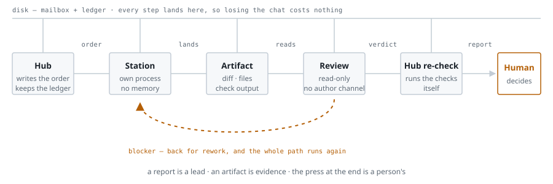

# Switchboard

**An operating model for running several coding agents on one codebase over weeks, not minutes.**

It is not a framework. There is nothing to install. It is a handful of rules that must not be broken, plus one move: **take the state out of the conversation and put it on disk.**

*中文版:[README.zh.md](README.zh.md)*

---

## The problem it solves

The most common failure of a coding agent is **not writing bad code**. It is **sincerely reporting something it believes happened.**

It will tell you "done, tests pass" — and it means it. But the test may never have reached that line. The assertion it added may be hollow. It may have edited a different file. **In a purely conversational setup, you have no cheap way to find this out.**

Add three more facts of life:

- Context gets compacted, interrupted, restarted. **Anything that exists only in the conversation can vanish at any moment.**
- An agent grading its own homework gives itself a good grade.
- One agent holding every tool means one mistake has the whole repository as its blast radius.

**Switchboard exists for those four things.**

---

## The life of a work order

<picture>
  <source media="(prefers-color-scheme: dark)" srcset="docs/flow-dark.svg">
  
</picture>

**Five stops that cannot be skipped, one way back.** There is no "just this once" shortcut.

---

## What goes wrong, and what this does about it

Every row is a real failure mode of one agent working alone in one conversation. **The last
column matters most: each claim comes with a way to prove it false.** A README that cannot
be falsified is a brochure.

| What you actually experience | Why it happens | What Switchboard does | How to check the fix is real |
|---|---|---|---|
| **"Done, tests pass" — and it isn't** | The only account of the work is the agent's own | Acceptance takes artifacts: the diff, the check output, the exact failure message | Delete the feature and run the suite. Still green? The guard was hollow |
| **Nobody notices for weeks** | The context that wrote the code is the context reviewing it | The reviewer has no write access and no channel to the author | Ask the reviewer to show a knife that went red. No knife, no review |
| **The reasoning is gone** | Compaction and restarts keep conclusions, not reasons | The ledger records the reasoning as it stood at the time | Pick a decision from a month ago; try to reconstruct why |
| **A crash costs the whole run** | One process holds both the work and its state | One-shot shifts; artifacts land on disk continuously | Kill a shift mid-task. Reconcile against disk. How much was actually lost? |
| **One mistake reaches everything** | All tools are available, always | Permissions are granted per order | Read the launch command. Does it list the tools this order needs, or every tool? |
| **The human is either blind or exhausted** | Approve every call, or approve nothing | The human appears only at the irreversible step | Count the interruptions in a day, and what each one was about |


## The five rules

### 1. Acceptance takes artifacts, not reports

"I finished it" is not acceptance. A diff, a file, the output of a check, a page you can open — that is acceptance.

> **Why:** a report is a lead, not evidence. The agent is not lying to you. It is sincerely describing something that did not happen.

### 2. Review is independent by construction

The reviewer has **no write access** to what it reviews, and **never talks to the author**. Findings go to the hub, which transcribes them into a work order.

> **Why:** telling an agent to "be objective" does very little. Removing its write access and cutting the channel to the author does a lot — it now has no option but to read the artifact. **Independence cannot be requested. It has to be built.**

### 3. State lives on disk

Orders, replies, decisions, rationale — all files. **The chat is the driver's seat, not the database.**

> **Why:** compaction, crashes and restarts are normal, not exceptional. What is on disk survives a new session, a new machine, a new person.

### 4. Shifts are one-shot; permissions are per-order

Every run is a **fresh process** with no memory of the last one, working from the order plus what is on disk. Tool permissions are granted **for that order only**.

> **Why:** no memory, no drift. Per-order permissions mean one mistake is bounded by one order.

### 5. A human presses anything irreversible

Merge, deploy, publish. Agents work up to "ready" — **the press is a person's.**

> **Why:** this is not distrust. It puts the human at the one point where the information is complete and the cost is highest, instead of asking them to review every change.

---

## How this differs from a conventional harness

By *harness* I mean the usual shape: one main agent, one process, one context, every tool; it spawns subagents when needed, and each subagent hands back **a paragraph of text**.

The difference is not "more agents." It is **where state lives, who verifies, and who may change what.**

| | Conventional harness | Switchboard |
|---|---|---|
| State | The conversation. Compaction or restart wipes it | **Files on disk** |
| Deliverable | A text summary; unverifiable | **An artifact a third party can inspect** |
| Who verifies | The same agent, grading itself | **A read-only reviewer, then the hub runs its own checks** |
| Review independence | A prompt asking for objectivity | **Structure:** no write access, no channel to the author |
| Blast radius | Process dies, the work and its state die with it | **One shift.** Reconcile against artifacts and continue |
| Permissions | One agent holds every tool, permanently | **Granted per order** |
| Parallelism | Bounded by one context window | **Real, across stations** — each with its own window |
| The human | Either watches everything or nothing | **Present only at the irreversible step** |

---

## What you get

1. **Long work stops being limited by context length.** The hub keeps **decisions and criteria**; detail stays in files. Context becomes a recyclable resource instead of a warehouse that fills up.
2. **Interruption stops being an event.** The worst case is **one shift**. Recovery is mechanical: reconcile against what is on disk, skip what is done, resume what is not.
3. **Quality comes from structure, not from asking nicely.** See rule 2.
4. **You can audit what happened.** Every dispatch, acceptance and decision is in the ledger **with the reasoning that was current at the time.** This is exactly what conversational collaboration loses — **conclusions survive, reasons do not.**
5. **Human attention goes where it matters.** What reaches the person is one line of conclusion and one line of *how it was verified* — not a transcript.

---

## What it costs

Leaving this section out would make the document an advertisement.

- **It is slow.** A mailbox round trip, a review pass, a re-check. **Running a typo fix through this is absurd.**
- **The hub is a bottleneck and a single point of failure.** If it mis-records, forgets to dispatch, or garbles someone's reasoning in transcription, the whole chain inherits the error. **The station that needs the most discipline is the hub itself.**
- **Re-reading.** Every shift reloads its context from scratch. That is the price of having no memory.
- **Bookkeeping is real work.** Dispatch and record-keeping must be the same action. **Miss once and the status display is lying** — while everyone is making decisions from it.

---

## When not to use it

Two questions: **how expensive is being wrong, and will this work span an interruption?**

One-off edits, exploration, a quick question — **just do the work.** Do not start a process.

**A rule is worth what it is actually held to, not what it says.** Applied where it is not warranted, it will be broken; and a rule that is broken quietly is worse than no rule, because everyone still believes it is there.

---

## Getting started

```bash
git clone https://github.com/tommyy1708/on-chain-agents-method.git coordination
cd coordination && cp ledger.example.json ledger.json
```

**→ [SETUP.md](SETUP.md) — the layout, your first order end to end, and what not to do.**

The one thing to get right before anything else is the layout: **your codebase, one working
copy per station, and a coordination directory that belongs to no station.** If the mailbox
and the ledger live inside a station's territory, that station can edit its own report card.

```
PROTOCOL.md            Roles, mailbox, message format, who may write to whom
ACCEPTANCE.md          What counts as an artifact; how to run mutation checks
SETUP.md               Install and first run
BENCHMARK.md           Evaluation design (not yet run — see the file)
example/               One order start to finish — read 04-reply-review.md first
templates/             Work order · review order · reply
mailbox/               Directory skeleton
ledger.example.json    Ledger shape
scripts/dispatch.sh    Start one shift AND record it — the two cannot come apart
scripts/accept.sh      Close a shift AND record how it was verified (--note required)
scripts/statusline.sh  Reads the ledger, prints who is busy on one line
```

**Requirements:** bash, python3, git, and an agent CLI that runs one-shot and
non-interactive with a way to restrict its tools — for example
`claude -p "<prompt>" --allowedTools "…"`.

**Do not start with the reviewer.** The first two rules — artifact acceptance and state on
disk — solve most of it, and cost nothing. Independent review is step two.

---

## Where this came from

None of this was designed up front. It was **forced out by incidents during continuous use on a real project**. Every rule has a specific failure behind it. The project itself is out of scope for this repository.

---

## License

MIT — see [LICENSE](LICENSE).
# On-Chain-Agent-Sync
